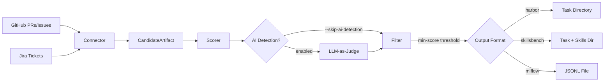

# rhai-datasets

Dataset creation and curation platform for Red Hat AI evaluation. Mines GitHub PRs/issues and Jira tickets to build ground-truth evaluation datasets for AI coding agents.

## Quickstart

```bash
# Install
uv sync --extra all

# Scan a GitHub repo for candidates
export GITHUB_TOKEN=ghp_...
uv run datasets recommend --source github --repo org/repo --since 2025-01-01 -o candidates.json

# Create evaluation datasets
uv run datasets create --from-file candidates.json --format harbor -o output/
```

## Why

AI coding agents need real-world evaluation datasets to measure performance. Manually curating tasks from PRs and issues is slow and subjective. This platform automates the discovery, scoring, and packaging of ground-truth candidates into formats consumed by evaluation harnesses like Harbor and MLflow.

## How It Works



**Connectors** scan sources for candidate artifacts (merged PRs, resolved issues). The **scorer** evaluates each candidate across five dimensions. An optional **AI detection** pass flags machine-generated content. Candidates above the score threshold are passed to a **factory** that produces format-specific output.

## Creating Datasets

### Harbor

Full containerized task directory for agent evaluation via [Harbor](https://github.com/redhat-ai-tools/agent-eval-harness).

```bash
uv run datasets create --from-file candidates.json --format harbor -o output/
```

Produces one directory per candidate:

```
task-name/
├── instruction.md            # Task description
├── task.toml                 # Metadata, timeouts, resource limits
├── environment/
│   └── Dockerfile            # Python 3.12-slim base image
├── tests/
│   ├── test.sh               # Runs pytest, writes reward.txt
│   └── test_outputs.py       # Placeholder test scaffold
└── solution/
    └── solve.sh              # Oracle solution placeholder
```

After creation, you should:
1. Write real tests in `test_outputs.py` that verify the task was solved
2. Flesh out `solve.sh` with the reference solution
3. Customize the `Dockerfile` if the task needs additional dependencies

### SkillsBench

Extends Harbor with a `skills/` directory for agent skill training tasks.

```bash
uv run datasets create --from-file candidates.json --format skillsbench -o output/
```

Produces the same structure as Harbor, plus `environment/skills/` for skill definitions. Use this format when evaluating agent tool-use or skill-based capabilities.

### MLflow

Single JSONL file for ML evaluation pipelines.

```bash
uv run datasets create --from-file candidates.json --format mlflow -o output/
```

Produces one `.jsonl` file per candidate with this record structure:

```json
{
  "inputs": {
    "task_description": "Fix the null pointer in auth handler",
    "title": "NPE in AuthHandler.validate()",
    "files": ["src/auth/handler.py", "tests/test_auth.py"]
  },
  "expectations": {
    "task_completed": true,
    "files_modified": ["src/auth/handler.py", "tests/test_auth.py"]
  },
  "tags": {
    "source_url": "https://github.com/org/repo/pull/42",
    "source_type": "github_pr",
    "ai_generation_score": 0.12
  }
}
```

## Integration

### Harbor / EvalHub

The Harbor output is ready for [agent-eval-harness](https://github.com/redhat-ai-tools/agent-eval-harness). The `task.toml` defines agent/verifier timeouts (900s each), resource limits (1 CPU, 4GB RAM, 10GB storage), and metadata. The `test.sh` script runs pytest and writes a reward file (`1` for pass, `0` for fail) that the harness reads.

### MLflow

The JSONL output is structured for `mlflow.evaluate()`. The `inputs` dict provides task context, `expectations` defines success criteria, and `tags` carry provenance metadata including the AI detection score.

### Dataset Catalog

Browse reviewed external datasets:

```bash
uv run datasets catalog list
uv run datasets catalog list --domain security --format harbor
```

Register your own by adding a YAML file to `catalog/external/`:

```yaml
name: my-dataset
source: "Internal"
source_url: "https://example.com/dataset"
task_count: 50
domain:
  - software-engineering
difficulty_profile: medium
format: harbor
applicability: "Agent coding evaluation for Python microservices"
```

## Scoring

Candidates are scored across five dimensions with weighted averaging:

| Dimension | Weight | What it measures |
|-----------|--------|------------------|
| Clarity | 25% | Description quality, reproduction steps, expected/actual behavior |
| Verifiability | 30% | Merged status, test files present, patches available |
| Difficulty | 15% | Patch size, number of files, component spread |
| Domain Relevance | 15% | Domain match (currently returns 0.5 — stub) |
| Completeness | 15% | Presence of title, description, files, patches |

Use `--min-score` to set the threshold (default: 0.4). Higher values produce fewer but stronger candidates.

Unmerged PRs score 0 on verifiability. PRs marked "Won't Fix" or "Duplicate" are heavily penalized.

## AI-Generated Content Detection (Experimental)

The recommender includes an LLM-as-judge detector that scores patches and descriptions for AI-generated content. This helps filter out synthetic PRs that don't represent genuine human problem-solving.

**How it works:** Each candidate's patches and description are sent to Claude, which scores them 0.0 (definitely human) to 1.0 (definitely AI-generated). The score is stored in the candidate metadata and passed through to MLflow output.

**Limitations:**
- Single-model judge — no cross-validation with other models
- Falls back to keyword heuristics if the API response can't be parsed
- Each candidate requires an API call, so large scans incur cost
- Detection accuracy is best-effort, not validated against a labeled corpus

**Usage:**

```bash
# Enabled by default (requires ANTHROPIC_API_KEY)
export ANTHROPIC_API_KEY=sk-...
uv run datasets recommend --source github --repo org/repo -o candidates.json

# Skip to save time/cost
uv run datasets recommend --source github --repo org/repo --skip-ai-detection -o candidates.json
```

## Dataset Lifecycle

1. **Discover** — Scan sources with `datasets recommend`. Use `--since` to scope to recent activity.
2. **Score** — Candidates are automatically scored. Review the output and adjust `--min-score` if needed.
3. **Filter** — Edit `candidates.json` manually to remove false positives or add context.
4. **Create** — Run `datasets create` to generate format-specific output.
5. **Customize** — Write real tests, solutions, and Dockerfiles for Harbor/SkillsBench tasks.
6. **Register** — Add finished datasets to the catalog via `catalog/external/` YAML entries.
7. **Iterate** — Re-scan periodically with `--since` to pick up new candidates.

## Contributing

```bash
# Setup
git clone https://github.com/jeremyeder/rhai-datasets.git
cd rhai-datasets
uv sync --extra all

# Run checks
uv run pytest
uv run ruff check src/ tests/
uv run mypy src/

# Workflow
git checkout -b feature/your-change
# make changes
uv run pytest
git commit
# open PR
```

### Adding a new connector

Implement the `SourceConnector` protocol in `src/datasets/connectors/`:

```python
@runtime_checkable
class SourceConnector(Protocol):
    @property
    def name(self) -> str: ...
    def scan(self, ...) -> list[CandidateArtifact]: ...
```

### Adding a new output format

Implement the `DatasetFactory` protocol in `src/datasets/factory/`:

```python
@runtime_checkable
class DatasetFactory(Protocol):
    @property
    def format_name(self) -> str: ...
    def create(self, candidate, output_dir, task_name) -> Path: ...
```

## License

Apache-2.0
